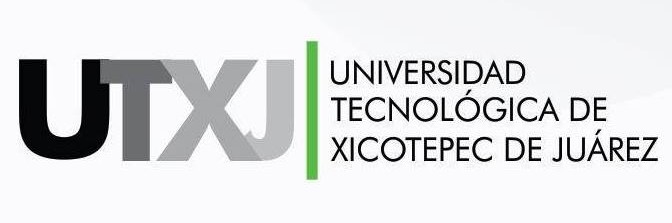

# Introducción a Dart M-220100

	
	

<h2>Universidad Tecnológica de Xicotepec de Juárez</h2>

**Materia:**   
**Alumno:** Neftali Arturo Hernandez Vergara  
**Matrícula:** 220100  
**Práctica:** Ejercicios de Introducción a Dart  

**Descripción:** Este proyecto contiene una serie de ejercicios prácticos para aprender los conceptos fundamentales del lenguaje Dart. Incluye ejemplos de variables, estructuras de control, funciones, clases, colecciones y más, orientados a fortalecer la lógica de programación y la comprensión de la sintaxis de Dart. Cada archivo aborda un tema específico, permitiendo al estudiante practicar y experimentar con el código de manera interactiva.

**Fecha de Entrega:** 25 Septiembre 2025
